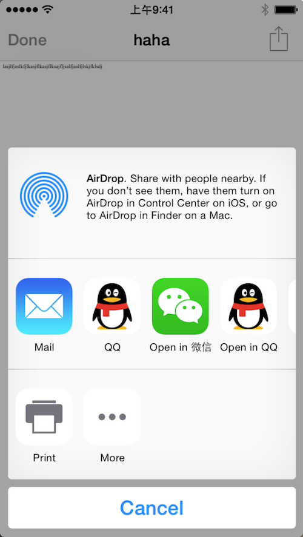
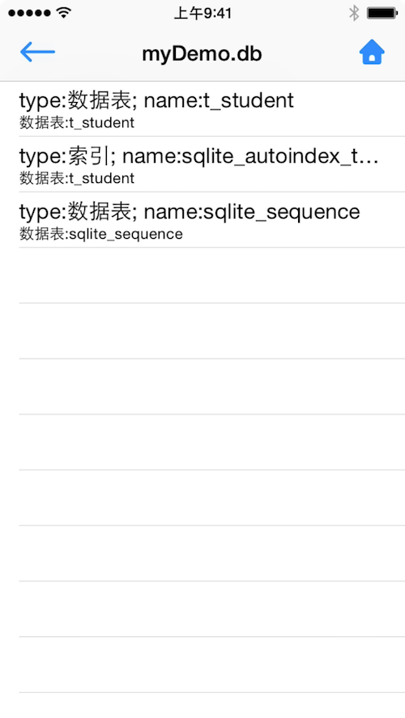
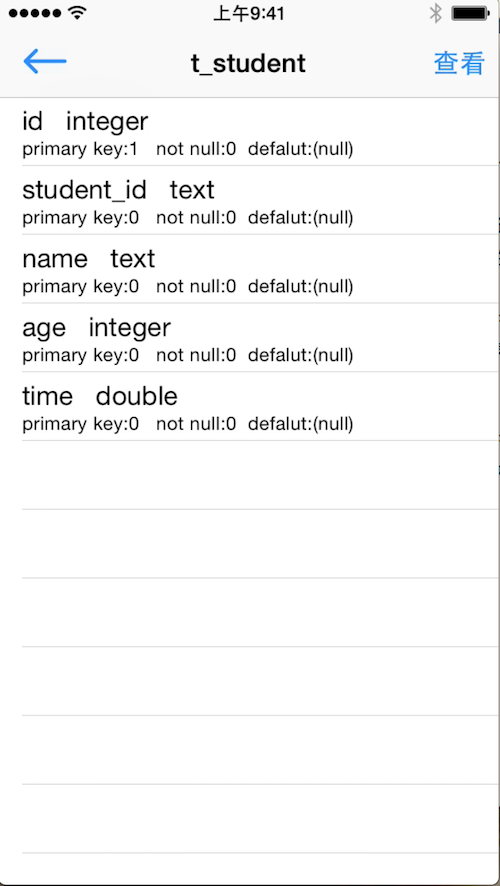
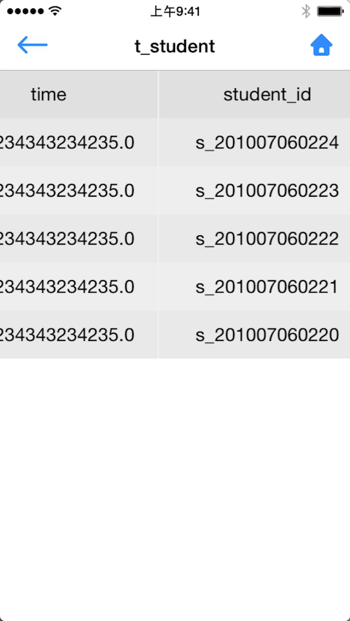
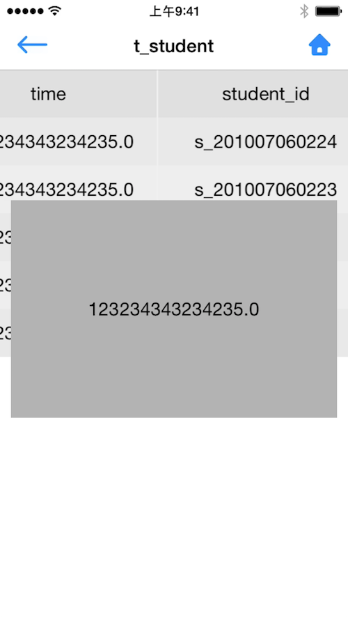

# SBWatcher
A Realtime File Browse on SandBox
* 一个简单，方便的沙盒文件实时查看器
* 无侵入性，一句话集成

Github: <a href="https://github.com/smallyou/SBWatcher">smallyou</a>  |  简书: <a href="http://www.jianshu.com/u/ebb60643b57c">smallyou</a>

# Plan

- [x] 一般文件预览
- [x] 数据库文件预览
- [ ] 局域网内浏览
- [ ] 数据库文件发送

# 1 开始使用

## 1.1 特点

* 简单，无侵入性
* 一句话集成，能够直接打开数据库文件
* 可通过AirDrop/QQ/Wechat发送文件到电脑，或者直接真机预览文件

## 1.2 安装

### 1.2.1 手动安装

直接将SBWatcher文件夹拖到工程中，即可。

### 1.2.2 cocoapods

暂不支持，后续支持...

# 2 全局注册

## 2.1 引入头文件

~~~
#import "SBWatcherHeader.h"
~~~
	
## 2.2 注册

~~~

- (void)viewDidLoad {
    [super viewDidLoad];
    
    //注册观察者
    [[SBWatcherManager shareManager] registWatcher];
}

~~~

# 3 功能简介

## 3.1 文件预览

使用了iOS自带框架QuickLook预览文件，并可以通过右上角的分享按钮将文件通过AirDrop/QQ/Wechat发送到电脑上查看。

## 3.2 SQLite数据库文件预览

通过SQLite3，对数据库进行只读查询，再不破坏现有文件的基础上最大限度的展示数据库信息。

### 3.2.1 数据库信息

查看当前数据库中的所有数据表、索引信息

### 3.2.2 数据表字段信息

选中数据表后，能看到当前数据表的所有字段信息

* 字段名称
* 字段类型
* 主键信息
* 唯一性约束
* 非空约束
* 默认值约束

### 3.2.3 数据表记录

能够根据查询指定字段的记录，并可点击查看字段详情

